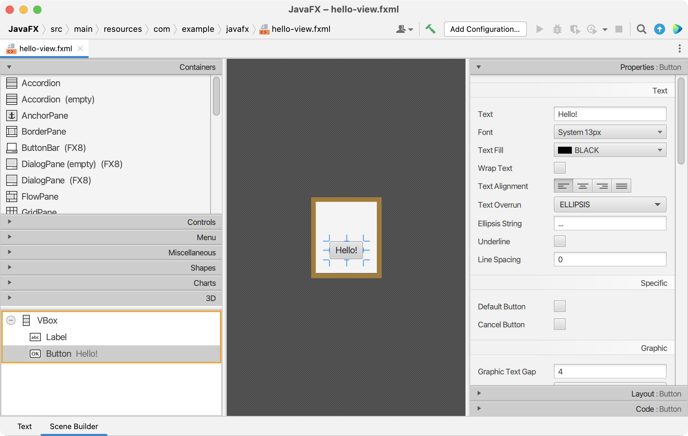
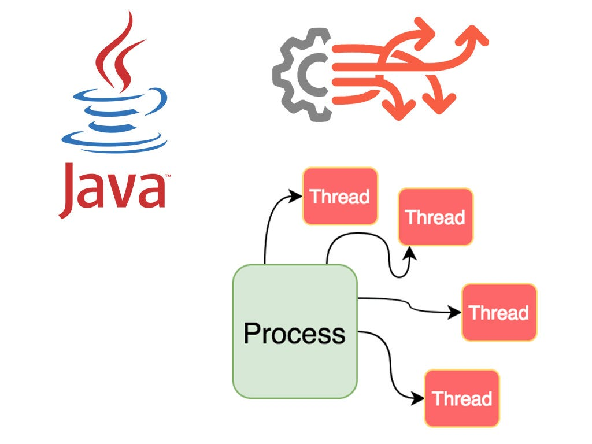
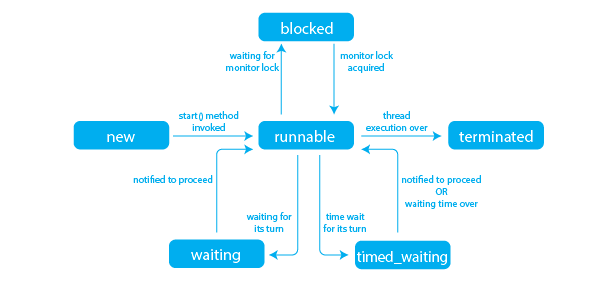
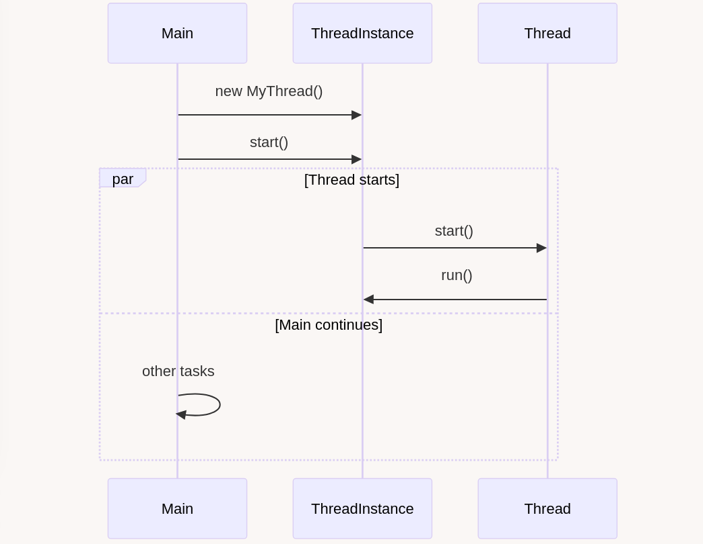
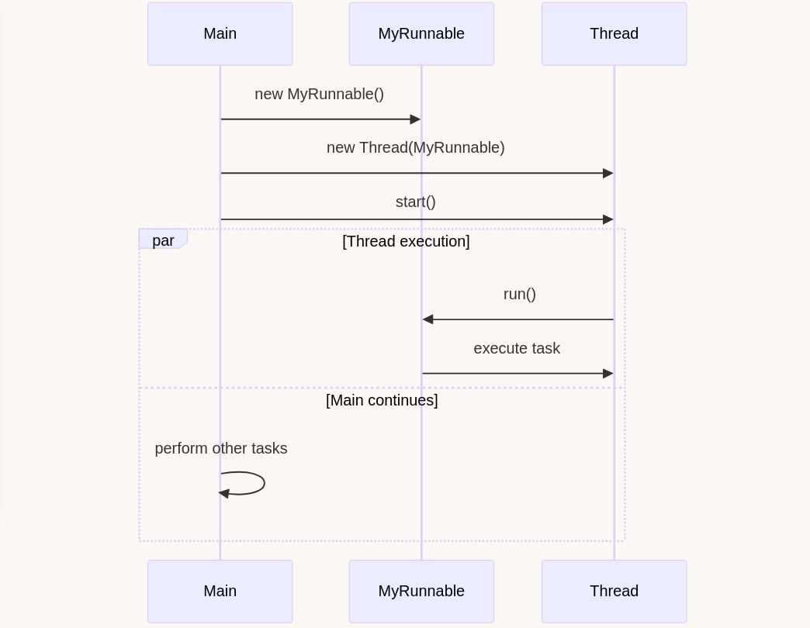
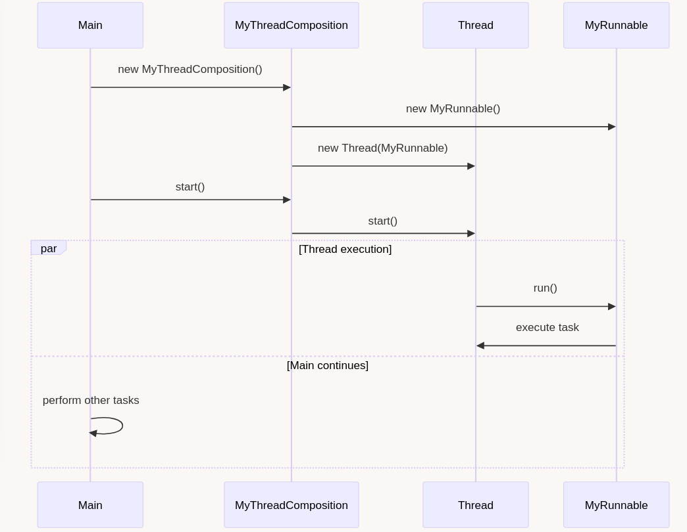
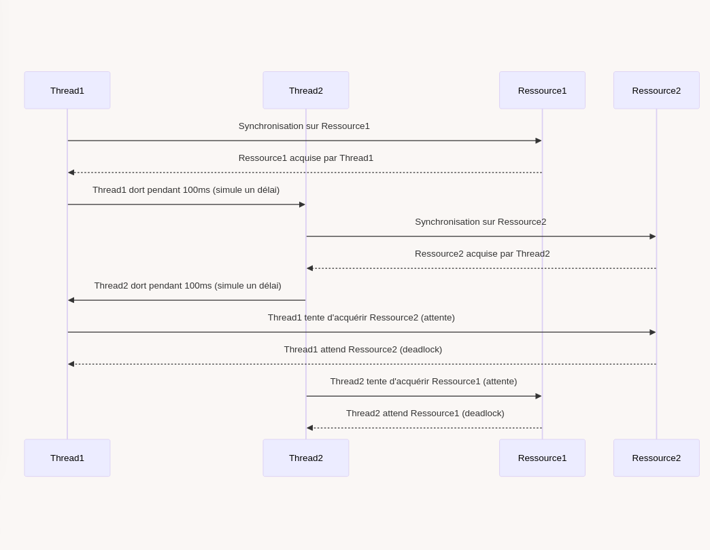
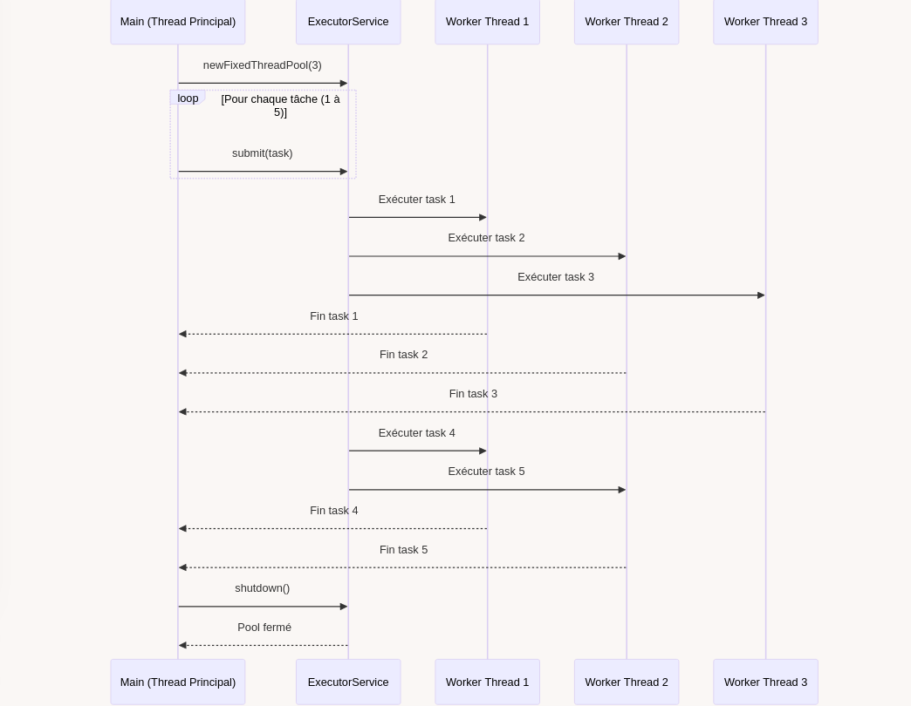

# Organisation de l'unité

- 2H par semaine de théorie
- 4H par semaine de laboratoire
- Planning détaillé disponible sur PoEsi  

--- 
 
<!-- _class: cite -->        

L'**évaluation** repose sur un contrôle **continu** structuré autour de la réalisation d’un **projet en binôme**. Une **défense individuelle** sera organisée afin d’évaluer les aspects techniques du projet, au cours de laquelle chaque étudiant devra également répondre à une **question théorique** sur les concepts abordés en cours. 

---
<!-- _class: transition2 -->  

Interface utilisateur avec Scene Builder<br>
Utilisation de fichiers FXML

--- 

# Une approche déclarative pour JavaFX

<div class="columns">

<div>

- Séparation entre logique et interface utilisateur
- Facilite la collaboration entre développeurs et designers
- Lisibilité améliorée du code
- Réutilisation et modularité

</div>

<div>

```xml
<?xml version="1.0" encoding="UTF-8"?>

<?import javafx.geometry.Insets?>
<?import javafx.scene.control.Label?>
<?import javafx.scene.layout.VBox?>

<?import javafx.scene.control.Button?>

<VBox alignment="CENTER" spacing="20.0" xmlns:fx="http://javafx.com/fxml">
    <padding>
        <Insets bottom="20.0" left="20.0" right="20.0" top="20.0"/>
    </padding>

    <Label text="Bonjour, FXML!" />
    <Button text="Cliquez-moi" onAction="#onHelloButtonClick"/>

</VBox>
```

<figcaption align="center">
<b>Code</b>: FXML Hello World.
</figcaption>

</div>

</div>

---

# Qu'est-ce que le FXML ?

- Un langage basé sur XML permettant de définir des interfaces JavaFX
- Chargé et interprété à l'exécution par JavaFX
- Permet de créer des interfaces graphiques dynamiques

Exemple :
```xml
<VBox xmlns="http://javafx.com/javafx" 
      xmlns:fx="http://javafx.com/fxml">
    <Label text="Bonjour, FXML!" />
    <Button text="Cliquez-moi" />
</VBox>
```

---

# Balises et équivalence avec JavaFX

- `<VBox>` équivaut à `new VBox()` en Java
- `<Label text="Texte"/>` équivaut à `new Label("Texte")`
- `<Button>` équivaut à `new Button()`

Exemple JavaFX classique :
```java
VBox vbox = new VBox();
Label label = new Label("Bonjour, JavaFX!");
Button button = new Button("Cliquez-moi");
vbox.getChildren().addAll(label, button);
```

---

# Transformation d'une balise VBox

- On peut enrichir cette balise avec des attributs pour mieux contrôler l'affichage :
    - `alignment="CENTER"` : Centre les éléments à l'intérieur de la VBox.
    - `spacing="20.0"` : Définit un espacement de 20 pixels entre les éléments.


<div class="columns">

<div>

### FXML

```xml
<VBox alignment="CENTER" 
      spacing="20.0" 
      xmlns:fx="http://javafx.com/fxml">
```

</div>
<div>

### Equivalent Java

```java
VBox vbox = new VBox();
vbox.setAlignment(Pos.CENTER);
vbox.setSpacing(20.0);
```
</div>
</div>

---

# Import et première balise en FXML

- Un fichier FXML commence toujours par une balise de conteneur racine : la **root** .
- La root est de type `VBox` dans l'exemple.
- L'attribut `xmlns` est obligatoire et définit l'espace de noms XML utilisé.
- L'attribut `xmlns:fx` est utilisé pour les fonctionnalités spécifiques à JavaFX.

Exemple :
```xml
<VBox xmlns="http://javafx.com/javafx" 
      xmlns:fx="http://javafx.com/fxml">
```

- On doit importer des classes Java directement dans FXML :
```xml
<?import javafx.scene.control.Label?>
<?import javafx.scene.layout.VBox?>
<?import javafx.scene.control.Button?>
```
---

# Déclaration XML en FXML

- Chaque fichier FXML commence par une déclaration XML standard.
- Cette déclaration spécifie la version XML et l'encodage utilisé.
- Obligatoire pour assurer la compatibilité avec les analyseurs XML.

Exemple :
```xml
<?xml version="1.0" encoding="UTF-8"?>
```
- `version="1.0"` : Définit la version XML utilisée.
- `encoding="UTF-8"` : Spécifie l'encodage des caractères, essentiel pour la prise en charge des accents et caractères spéciaux.

---

# Dépendances Maven pour JavaFX et FXML

Dans le fichier `pom.xml`, ajoutez les dépendances suivantes :
```xml
<dependency>
    <groupId>org.openjfx</groupId>
    <artifactId>javafx-controls</artifactId>
    <version>17</version>
</dependency>
<dependency>
    <groupId>org.openjfx</groupId>
    <artifactId>javafx-fxml</artifactId>
    <version>17</version>
</dependency>
```

- `javafx-controls` : Contient les composants UI JavaFX
- `javafx-fxml` : Permet d'utiliser FXML dans l'application

---

# SceneBuilder : Interface graphique pour créer du FXML

<div class="columns-center">
<div>

<center>



<figcaption align="center">
<b>Figure</b>: Scene Builder.
</figcaption>
</center>

</div>
<div>

- Permet de générer du FXML visuellement
- Facile d'utilisation pour les non-développeurs
- Génère automatiquement les IDs et méthodes associées

</div>
</div>

---

# Structure d'un projet Maven avec FXML - Version 1

```
my-javafx-app/
│-- src/
│   ├── main/
│   │   ├── java/
│   │   │   └── com/example/app/
│   │   │       ├── Main.java
│   │   ├── resources/
│   │   │   └── com/example/app/
│   │   │       ├── view.fxml
│-- pom.xml
```
- `Main.java` : Classe principale pour lancer l'application JavaFX.
- `view.fxml` : Définit l'interface graphique.

---

# Charger un fichier

```java
public class Main extends Application {
    @Override
    public void start(Stage stage) throws IOException {
        URL resource = Main.class.getResource("hello-view.fxml");
        FXMLLoader loader = new FXMLLoader(resource);
        Parent root = loader.load();
        Scene scene = new Scene(root, 640, 800);
        stage.setTitle("Hello!");
        stage.setScene(scene);
        stage.show();
    }

    public static void main(String[] args) {
        launch();
    }
}
```

---

# Une nouvelle classe : le Contrôleur FXML

- Lien entre FXML et logique Java
- Utilisation de `FXMLLoader` pour charger le fichier FXML
- Annotation `@FXML` pour lier les composants
- `@FXML` est utilisé pour injecter l'élément défini dans le fichier FXML.
- Gestion des événements avec `EventHandler`

---

# Structure d'un projet Maven avec FXML - Version 2

```
my-javafx-app/
│-- src/
│   ├── main/
│   │   ├── java/
│   │   │   └── com/example/app/
│   │   │       ├── Main.java
│   │   │       ├── FxmlController.java
│   │   ├── resources/
│   │   │   └── com/example/app/
│   │   │       ├── view.fxml
│-- pom.xml
```
- `Main.java` : Classe principale pour lancer l'application JavaFX.
- `Controller.java` : Gère la logique associée aux événements FXML.
- `view.fxml` : Définit l'interface graphique.

---

# Utilisation de `fx:id`

- `fx:id` permet d'identifier un élément du fichier FXML pour y accéder dans le contrôleur.

### Exemple :
```xml
<VBox xmlns:fx="http://javafx.com/fxml">
    <Button fx:id="myButton" text="Cliquez-moi"/>
</VBox>
```

### Accès en Java :
```java
public class Controller {
    @FXML
    private Button myButton;
}
```


---

# Utilisation de `fx:controller`

`fx:controller` spécifie la classe Java qui gère la logique de l'interface.

### Exemple :
```xml
<VBox xmlns:fx="http://javafx.com/fxml" fx:controller="com.example.FxmlController">
    <Button fx:id="myButton" text="Cliquez-moi"/>
</VBox>
```

### Accès en Java :
```java
public class FxmlController {
    @FXML
    private Button myButton;
}
```
---

# La méthode `initialize()` du contrôleur

- La méthode `initialize()` est automatiquement appelée **après l'instanciation** du contrôleur.
- Elle permet d'initialiser des composants.

### Exemple :
```java
public class FxmlController {
    @FXML private Label label;

    public void initialize() {
        label.setText("Bienvenue dans l'application!");
    }
}
```

---
# Notions avancées : `TableView` et `ObservableList`

- Une `ObservableList` est une liste dynamique qui permet de notifier les changements à l'interface utilisateur.
- Utile pour gérer des données affichées dans des composants comme `TableView`.
- `TableView` est un composant permettant d'afficher des données tabulaires.

---

# Déclaration d'un `TableView` en FXML

```xml
<TableView fx:id="personTable" xmlns:fx="http://javafx.com/fxml">
    <columns>
        <TableColumn text="Nom" fx:id="nameColumn" />
        <TableColumn text="Âge" fx:id="ageColumn" />
    </columns>
</TableView>
```

---

# Contrôleur associé à une `TableView` en FXML

```java
public class FxmlController {
    @FXML private TableView<Person> personTable;
    @FXML private TableColumn<Person, String> nameColumn;
    @FXML private TableColumn<Person, Integer> ageColumn;

    public void initialize() {
        ObservableList<String> items = 
            FXCollections.observableArrayList(person1, person2);
        nameColumn.setCellValueFactory(
            new PropertyValueFactory<>("name"));
        ageColumn.setCellValueFactory(
            new PropertyValueFactory<>("age"));
        personTable.setItems(items);
    }
}
```

---

# Import de composants de `org.controlsfx`

- Bibliothèque JavaFX avancée
- `SearchableComboBox` pour une liste déroulante avec recherche intégrée

Exemple :
```java
SearchableComboBox<String> comboBox = new SearchableComboBox<>();
comboBox.getItems().addAll("Option 1", "Option 2");
```

---

# Navigation entre vues et patterns

- Utilisation de `FXMLLoader` pour charger dynamiquement les vues
- Patterns recommandés : **MVC** ou ses variants

Exemple de changement de scène :
```java
Parent newView = FXMLLoader.load(getClass().getResource("view.fxml"));
stage.setScene(new Scene(newView));
```

---

# FXML et CSS dans `src/main/java/resources`

<div class="columns" align="center">
<div>         

## styles.css

```css
.root {
    -fx-background-color: lightgray;
}

.button {
    -fx-background-color: blue;
    -fx-text-fill: white;
}
```
   
</div>
<div>

## hello-world.fxml

```xml
<VBox xmlns="http://javafx.com/javafx"
      xmlns:fx="http://javafx.com/fxml"
      stylesheets="@styles.css">
    <Button text="Bouton Stylisé" 
            styleClass="button"/>
</VBox>
```

</div>
</div>

- `stylesheets="@styles.css"` : Charge le fichier CSS.
- `styleClass="button"` : Applique la classe CSS définie.
--- 

# Structure d'un projet Maven avec FXML - Version 3

```
my-javafx-app/
│-- src/
│   ├── main/
│   │   ├── java/
│   │   │   └── com/example/app/
│   │   │       ├── Main.java
│   │   │       ├── FxmlController.java
│   │   ├── resources/
│   │   │   └── com/example/app/
│   │   │       ├── view.fxml
│   │   │       ├── styles.css
│   │   │       ├── images/
│-- pom.xml
```
---

<!-- _class: biblio -->

# References 
<div class="columns">
<div>

OpenJFX. **OpenJFX**. Consulté le 1er février 2025. [https://openjfx.io/](https://openjfx.io/).

OpenJFX. **JavaDoc 23**. Consulté le 1er février 2025. [https://openjfx.io/javadoc/23/](https://openjfx.io/javadoc/23/).

GluonHQ. **Scene Builder**. Consulté le 1er février 2025. [https://gluonhq.com/products/scene-builder/](https://gluonhq.com/products/scene-builder/).

</div>

<div>

ControlsFX. **ControlsFX**. Consulté le 1er février 2025. [https://controlsfx.github.io/](https://controlsfx.github.io/).

OpenJFX. **Référence CSS JavaFX**. Consulté le 1er février 2025. [https://openjfx.io/javadoc/23/javafx.graphics/javafx/scene/doc-files/cssref.html](https://openjfx.io/javadoc/23/javafx.graphics/javafx/scene/doc-files/cssref.html).


</div>
</div>

---
<!-- _class: transition2 -->  

Programmation concurrente<br>
Les threads en java


---

# Introduction

<div class="columns">
<div>

<center>



</center>

</div>
<div>


### Définition
- Un **thread** est une unité d'exécution au sein d'un processus.
- Permet l'exécution parallèle de tâches.

### Avantages du multithreading en Java
- **Meilleure utilisation des ressources**.
- **Réduction du temps d'attente** pour certaines tâches.
- **Amélioration de la réactivité** des applications.

</div>
</div>

---

# Le cycle de vie d'un thread

<div class="center">         
 

   
</div> 

---

# Création d'un Thread

<!-- _class: cool-list -->

1. *Héritage de la classe Thread*
2. *Implémentation de l'interface Runnable*
3. *Composition via un attribut Thread*

---

# Création d'un Thread

<div class="columns">
<div>

<center>



</center>

</div>
<div>

## Héritage de la classe Thread

```java
class MyThread extends Thread {
    public void run() {
        System.out.println("Thread en cours d'exécution");
    }
}

MyThread t = new MyThread();
t.start();
```

</div>
</div>

> [Lien vers les codes exemples utilisés lors de la présentation](https://git.esi-bru.be/4prj1d-ressources/demo-thread)
---


# Création d'un Thread

<div class="columns">
<div>

<center>



</center>

</div>
<div>

## Implémentation de l'interface Runnable

```java
class MyRunnable implements Runnable {
    public void run() {
        System.out.println("Thread en cours d'exécution");
    }
}

Thread t = new Thread(new MyRunnable());
t.start();
```

</div>
</div>

---


# Création d'un Thread

<div class="columns">
<div>

<center>



</center>

</div>
<div>

## Composition via un attribut

```java
public class MyThreadComposition {

    private Thread thread;

    public MyThreadComposition() {
        thread = new Thread(new MyRunnable());
    }

    public void start() {
        thread.start();
    }

}
```

</div>
</div>

---

# Différences entre la méthode start et run

- `start()` : démarre l'exécution du thread, elle appelle **automatiquement** la méthode `run()` dans un **nouveau thread** d'exécution.

- `run()` : méthode qui contient le code à exécuter dans le thread. Si vous définissez une classe qui **implémente Runnable** ou **étend Thread**, vous redéfinissez cette méthode pour spécifier ce que doit faire le thread. Si vous appelez directement `run()`, le code sera exécuté dans le thread principal, pas dans un nouveau thread.

---

# Threads Démon

Un **thread démon** s'exécute en arrière-plan et ne bloque pas la fermeture de l'application.

```java
Thread daemonThread = new Thread(() -> {
    while (true) {
        System.out.println("Daemon thread en cours");
    }
});

daemonThread.setDaemon(true);
daemonThread.start();
```

---

# Attendre la fin d'un Thread avec la méthode `join()`

<div class="columns">
<div>


```java
public class MonThread extends Thread {

    @Override
    public void run() {

        try {

            System.out.println("Le thread commence");

            // Simuler un travail en suspendant 
            // le thread  pendant 2 secondes
            Thread.sleep(2000);

            System.out.println("Le thread se " +
              " termine après 2 secondes.");

        } catch (InterruptedException e) {
            e.printStackTrace();
        }

    }
}


```

</div>
<div>


```java
public static void main(String[] args) {

    MonThread monThread = new MonThread();
    monThread.start();

    try {

        System.out.println(
          "Main attend la fin du thread");

        monThread.join();

        System.out.println(
          "Main reprend après la fin du thread");

    } catch (InterruptedException e) {
        e.printStackTrace();
    }

    System.out.println(
      "Le programme principal se termine.");
}
```

</div>
</div>

---


# Quelle est la valeur affichée ?

<div class="columns">
<div>


```java
public class MonCompteur
    implements Runnable {

    // Variable partagée entre les threads
    private static int compteur = 0;

    private void incrementer() {
        compteur++;
    }

    @Override
    public void run() {
        for (int i = 0; i < 1000; i++) {
            incrementer();
        }
    }
}
```

</div>
<div>


```java
public static void main(String[] args) 
    throws InterruptedException {

    MonCompteur monCompteur = new MonCompteur();
    Thread t1 = new Thread(monCompteur);
    Thread t2 = new Thread(monCompteur);

    // Démarrer les threads
    t1.start();
    t2.start();

    // Attendre la fin des deux threads
    t1.join();
    t2.join();

    // Afficher la valeur finale du compteur
    System.out.println(
        "Valeur du compteur : " + compteur);
}
```

</div>
</div>


---

# Synchronisation et gestion de la concurrence

#### Méthode synchronisée

L'accès à cette méthode est limité à un seul thread à la fois.

```java
private synchronized void incrementer() {
    compteur++;
}
```

--- 

# Synchronisation et gestion de la concurrence

#### Bloc synchronisé

```java
public void incrementer() {
    // Code non synchronisé
    //avant le bloc
    
    // Bloc synchronisé
    synchronized(this) {
        compteur++;
    }
}
```

--- 

# Synchronisation et gestion de la concurrence

#### Synchronisation sur des objets spécifiques

```java
public class MonCompteur
    implements Runnable {

    private static int compteur = 0;

    private final Object verrou = new Object();  // Un objet pour le verrouillage

    public void incrementer() {
        synchronized(verrou) {
            compteur++;
        }
    }
}
```

---


# L'étreinte mortelle - Deadlock

<!-- <div class="columns">
<div> -->

<center>



<figcaption align="center">
Vision séquentielle des accès aux ressources, en réalité les actions sont concourantes.
</figcaption>

</center>

<!-- </div>
<div>

1. **Thread1** acquiert **Ressource1** et dort pendant 100 ms.
2. **Thread2** acquiert **Ressource2** et dort pendant 100 ms.
3. **Thread1** essaie de récupérer **Ressource2**, mais elle est déjà occupée par **Thread2**. **Thread1** se bloque en attendant.
4. **Thread2** essaie de récupérer **Ressource1**, mais elle est déjà occupée par **Thread1**. **Thread2** se bloque également en attendant.
5. Résultat : les deux threads sont **bloqués indéfiniment**, créant une **impasse** ou **deadlock**.

</div>
</div> -->


---


# Structures **thread-safe**


Structures de données conçues pour être utilisées en toute sécurité dans des environnements multithreads sans nécessiter de synchronisation externe.


<!-- _class: cool-list -->

Exemples : 

1. *SynchronizedList, SynchronizedSet, SynchronizedMap*
1. *ConcurrentSkipListMap, ConcurrentSkipListSet*
1. *CopyOnWriteArrayList, CopyOnWriteArraySet*
1. *Vector*


---

# Lister les Threads

`Thread.getAllStackTraces()` retourne les threads en cours d'exécution.

| **Nom du Thread**      | **Rôle** |
|------------------------|----------|
| `main`                | Le thread principal qui exécute la méthode `main()` |
| `Reference Handler`   | Gère les références|
| `Finalizer`           | Appelle la méthode `finalize()` |
| `Signal Dispatcher`   | Gère les signaux du système d'exploitation |

> Remarque : Le nombre exact peut varier selon la version de la JVM et l'environnement d'exécution.

---

# Threads et JavaFX

- **Main Thread** démarre l'application.
- **JavaFX Application Thread** gère l'UI.
- Une exception est lancée si une mise à jour est effectuée hors du **JavaFX Application Thread**,

```java
Exception in thread "Thread-XX" java.lang.IllegalStateException:
Not on FX application thread; currentThread = Thread-XX
```

---

# Threads et JavaFX

### Solution avec `Platform.runLater()`

<div class="columns">
<div>

```java
button.setOnAction(event -> {
    new Thread(() -> {
        try {
            Thread.sleep(2000);

            label.setText("Traitement "
                + " terminé !");  

        } catch (InterruptedException e) {
            e.printStackTrace();
        }
    }).start();
});

```

</div>
<div>


```java
button.setOnAction(event -> {
    new Thread(() -> {
        try {
            Thread.sleep(2000);

            Platform.runLater(()-> 
              label.setText("Traitement "
              + " terminé !"));

        } catch (InterruptedException e) {
            e.printStackTrace();
        }
    }).start();
});
```

</div>
</div>


---

# Threads et JavaFX

### Solution avec un Task<Void>
```java
Task<Void> task = new Task<>() {
        @Override
        protected Void call() throws Exception {
            label.setText("Mise à jour UI")
            return null;
        }
    };

// Liaison des propriétés du Task avec l'UI
label.textProperty().bind(task.messageProperty());
```

---

# Design Pattern Thread pool

## Principe

- Un nombre fixe ou dynamique de threads est maintenu dans un **pool**.
- Des tâches sont placées dans une file d'attente.
- Les threads du pool prennent et exécutent les tâches disponibles.
- Une fois une tâche terminée, le thread devient à nouveau disponible pour une nouvelle tâche

---


# Design Pattern Thread pool

<div class="columns">
<div>

<center>



</center>

</div>
<div>

```java
public static void main(String[] args) {
    // Création d'un pool de 3 threads
    ExecutorService executor = 
        Executors.newFixedThreadPool(3);

    // Soumission de 5 tâches au pool
    for (int i = 1; i <= 5; i++) {
        final int taskId = i;
        executor.submit(() -> {
            System.out.println("Tâche " + taskId + 
                " exécutée par " + 
                Thread.currentThread().getName());
            try {
                Thread.sleep(2000);
            } catch (InterruptedException ignored) {}
        });
    }

    executor.shutdown();
}
```

</div>
</div>


---

# JDK 21+ introduction des Virtual Threads

**Plus légers** et **scalables**.

```java
public static void main(String[] args) {
    Thread.startVirtualThread(() -> {
        System.out.println("Virtual Thread exécuté par : " + Thread.currentThread());
        try {
            Thread.sleep(1000); // Simulation d'un traitement
        } catch (InterruptedException e) {
            Thread.currentThread().interrupt();
        }
        System.out.println("Fin du Virtual Thread : " + Thread.currentThread());
    });

    System.out.println("Thread principal terminé : " + Thread.currentThread());
}
```

---

<!-- _class: biblio -->

# References 

Thread. **JavaDoc 23**. Consulté le 8 février 2025. [https://docs.oracle.com/en/java/javase/23/docs/api/java.base/java/lang/Thread.html](https://docs.oracle.com/en/java/javase/23/docs/api/java.base/java/lang/Thread.html).

ExecutorService. **JavaDoc 23**. Consulté le 8 février 2025. [https://docs.oracle.com/en/java/javase/23/docs/api/java.base/java/util/concurrent/ExecutorService.html](https://docs.oracle.com/en/java/javase/23/docs/api/java.base/java/util/concurrent/ExecutorService.html).

Asynchronous Programming in Java using Virtual Threads. **Venkat Subramaniam**. Consulté le 8 février 2025. [https://www.youtube.com/watch?v=uoTyIFvckXA](https://www.youtube.com/watch?v=uoTyIFvckXA).


---
<!-- _class: transition2 -->  

Design Pattern Repository<br>
JDBC et JPA

--- 

<div>         
 

   
</div> 


---
<!-- _class: transition2 -->  

Tester une application<br>
Des tests unitaires aux tests utilisateurs

--- 

<div>         
 

   
</div> 

---
<!-- _class: transition2 -->  

Architecture et gestion de projet<br>
MVC et ses variantes

--- 

<div>         
 

   
</div> 

---
<!-- _class: transition2 -->  

Présenter une analyse<br>

--- 

<div>         
 

   
</div> 