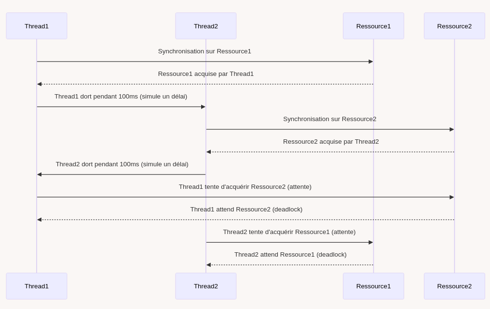

# Organisation de l'unité

- 2H par semaine de théorie
- 4H par semaine de laboratoire
- Planning détaillé disponible sur PoEsi  

--- 
 
<!-- _class: cite -->        

L'**évaluation** repose sur un contrôle **continu** structuré autour de la réalisation d’un **projet en binôme**. Une **défense individuelle** sera organisée afin d’évaluer les aspects techniques du projet, au cours de laquelle chaque étudiant devra également répondre à une **question théorique** sur les concepts abordés en cours. 

---
<!-- _class: transition2 -->  

Interface utilisateur avec Scene Builder<br>
Utilisation de fichiers FXML

--- 

# Une approche déclarative pour JavaFX

<div class="columns">

<div>

- Séparation entre logique et interface utilisateur
- Facilite la collaboration entre développeurs et designers
- Lisibilité améliorée du code
- Réutilisation et modularité

</div>

<div>

```xml
<?xml version="1.0" encoding="UTF-8"?>

<?import javafx.geometry.Insets?>
<?import javafx.scene.control.Label?>
<?import javafx.scene.layout.VBox?>

<?import javafx.scene.control.Button?>

<VBox alignment="CENTER" spacing="20.0" xmlns:fx="http://javafx.com/fxml">
    <padding>
        <Insets bottom="20.0" left="20.0" right="20.0" top="20.0"/>
    </padding>

    <Label text="Bonjour, FXML!" />
    <Button text="Cliquez-moi" onAction="#onHelloButtonClick"/>

</VBox>
```

<figcaption align="center">
<b>Code</b>: FXML Hello World.
</figcaption>

</div>

</div>

---

# Qu'est-ce que le FXML ?

- Un langage basé sur XML permettant de définir des interfaces JavaFX
- Chargé et interprété à l'exécution par JavaFX
- Permet de créer des interfaces graphiques dynamiques

Exemple :
```xml
<VBox xmlns="http://javafx.com/javafx" 
      xmlns:fx="http://javafx.com/fxml">
    <Label text="Bonjour, FXML!" />
    <Button text="Cliquez-moi" />
</VBox>
```

---

# Balises et équivalence avec JavaFX

- `<VBox>` équivaut à `new VBox()` en Java
- `<Label text="Texte"/>` équivaut à `new Label("Texte")`
- `<Button>` équivaut à `new Button()`

Exemple JavaFX classique :
```java
VBox vbox = new VBox();
Label label = new Label("Bonjour, JavaFX!");
Button button = new Button("Cliquez-moi");
vbox.getChildren().addAll(label, button);
```

---

# Transformation d'une balise VBox

- On peut enrichir cette balise avec des attributs pour mieux contrôler l'affichage :
    - `alignment="CENTER"` : Centre les éléments à l'intérieur de la VBox.
    - `spacing="20.0"` : Définit un espacement de 20 pixels entre les éléments.


<div class="columns">

<div>

### FXML

```xml
<VBox alignment="CENTER" 
      spacing="20.0" 
      xmlns:fx="http://javafx.com/fxml">
```

</div>
<div>

### Equivalent Java

```java
VBox vbox = new VBox();
vbox.setAlignment(Pos.CENTER);
vbox.setSpacing(20.0);
```
</div>
</div>

---

# Import et première balise en FXML

- Un fichier FXML commence toujours par une balise de conteneur racine : la **root** .
- La root est de type `VBox` dans l'exemple.
- L'attribut `xmlns` est obligatoire et définit l'espace de noms XML utilisé.
- L'attribut `xmlns:fx` est utilisé pour les fonctionnalités spécifiques à JavaFX.

Exemple :
```xml
<VBox xmlns="http://javafx.com/javafx" 
      xmlns:fx="http://javafx.com/fxml">
```

- On doit importer des classes Java directement dans FXML :
```xml
<?import javafx.scene.control.Label?>
<?import javafx.scene.layout.VBox?>
<?import javafx.scene.control.Button?>
```
---

# Déclaration XML en FXML

- Chaque fichier FXML commence par une déclaration XML standard.
- Cette déclaration spécifie la version XML et l'encodage utilisé.
- Obligatoire pour assurer la compatibilité avec les analyseurs XML.

Exemple :
```xml
<?xml version="1.0" encoding="UTF-8"?>
```
- `version="1.0"` : Définit la version XML utilisée.
- `encoding="UTF-8"` : Spécifie l'encodage des caractères, essentiel pour la prise en charge des accents et caractères spéciaux.

---

# Dépendances Maven pour JavaFX et FXML

Dans le fichier `pom.xml`, ajoutez les dépendances suivantes :
```xml
<dependency>
    <groupId>org.openjfx</groupId>
    <artifactId>javafx-controls</artifactId>
    <version>17</version>
</dependency>
<dependency>
    <groupId>org.openjfx</groupId>
    <artifactId>javafx-fxml</artifactId>
    <version>17</version>
</dependency>
```

- `javafx-controls` : Contient les composants UI JavaFX
- `javafx-fxml` : Permet d'utiliser FXML dans l'application

---

# SceneBuilder : Interface graphique pour créer du FXML

<div class="columns-center">
<div>

<center>


<figcaption align="center">
<b>Figure</b>: Scene Builder.
</figcaption>
</center>

</div>
<div>

- Permet de générer du FXML visuellement
- Facile d'utilisation pour les non-développeurs
- Génère automatiquement les IDs et méthodes associées

</div>
</div>

---

# Structure d'un projet Maven avec FXML - Version 1

```
my-javafx-app/
│-- src/
│   ├── main/
│   │   ├── java/
│   │   │   └── com/example/app/
│   │   │       ├── Main.java
│   │   ├── resources/
│   │   │   └── com/example/app/
│   │   │       ├── view.fxml
│-- pom.xml
```
- `Main.java` : Classe principale pour lancer l'application JavaFX.
- `view.fxml` : Définit l'interface graphique.

---

# Charger un fichier

```java
public class Main extends Application {
    @Override
    public void start(Stage stage) throws IOException {
        URL resource = Main.class.getResource("hello-view.fxml");
        FXMLLoader loader = new FXMLLoader(resource);
        Parent root = loader.load();
        Scene scene = new Scene(root, 640, 800);
        stage.setTitle("Hello!");
        stage.setScene(scene);
        stage.show();
    }

    public static void main(String[] args) {
        launch();
    }
}
```

---

# Une nouvelle classe : le Contrôleur FXML

- Lien entre FXML et logique Java
- Utilisation de `FXMLLoader` pour charger le fichier FXML
- Annotation `@FXML` pour lier les composants
- `@FXML` est utilisé pour injecter l'élément défini dans le fichier FXML.
- Gestion des événements avec `EventHandler`

---

# Structure d'un projet Maven avec FXML - Version 2

```
my-javafx-app/
│-- src/
│   ├── main/
│   │   ├── java/
│   │   │   └── com/example/app/
│   │   │       ├── Main.java
│   │   │       ├── FxmlController.java
│   │   ├── resources/
│   │   │   └── com/example/app/
│   │   │       ├── view.fxml
│-- pom.xml
```
- `Main.java` : Classe principale pour lancer l'application JavaFX.
- `Controller.java` : Gère la logique associée aux événements FXML.
- `view.fxml` : Définit l'interface graphique.

---

# Utilisation de `fx:id`

- `fx:id` permet d'identifier un élément du fichier FXML pour y accéder dans le contrôleur.

### Exemple :
```xml
<VBox xmlns:fx="http://javafx.com/fxml">
    <Button fx:id="myButton" text="Cliquez-moi"/>
</VBox>
```

### Accès en Java :
```java
public class Controller {
    @FXML
    private Button myButton;
}
```


---

# Utilisation de `fx:controller`

`fx:controller` spécifie la classe Java qui gère la logique de l'interface.

### Exemple :
```xml
<VBox xmlns:fx="http://javafx.com/fxml" fx:controller="com.example.FxmlController">
    <Button fx:id="myButton" text="Cliquez-moi"/>
</VBox>
```

### Accès en Java :
```java
public class FxmlController {
    @FXML
    private Button myButton;
}
```
---

# La méthode `initialize()` du contrôleur

- La méthode `initialize()` est automatiquement appelée **après l'instanciation** du contrôleur.
- Elle permet d'initialiser des composants.

### Exemple :
```java
public class FxmlController {
    @FXML private Label label;

    public void initialize() {
        label.setText("Bienvenue dans l'application!");
    }
}
```

---
# Notions avancées : `TableView` et `ObservableList`

- Une `ObservableList` est une liste dynamique qui permet de notifier les changements à l'interface utilisateur.
- Utile pour gérer des données affichées dans des composants comme `TableView`.
- `TableView` est un composant permettant d'afficher des données tabulaires.

---

# Déclaration d'un `TableView` en FXML

```xml
<TableView fx:id="personTable" xmlns:fx="http://javafx.com/fxml">
    <columns>
        <TableColumn text="Nom" fx:id="nameColumn" />
        <TableColumn text="Âge" fx:id="ageColumn" />
    </columns>
</TableView>
```

---

# Contrôleur associé à une `TableView` en FXML

```java
public class FxmlController {
    @FXML private TableView<Person> personTable;
    @FXML private TableColumn<Person, String> nameColumn;
    @FXML private TableColumn<Person, Integer> ageColumn;

    public void initialize() {
        ObservableList<String> items = 
            FXCollections.observableArrayList(person1, person2);
        nameColumn.setCellValueFactory(
            new PropertyValueFactory<>("name"));
        ageColumn.setCellValueFactory(
            new PropertyValueFactory<>("age"));
        personTable.setItems(items);
    }
}
```

---

# Import de composants de `org.controlsfx`

- Bibliothèque JavaFX avancée
- `SearchableComboBox` pour une liste déroulante avec recherche intégrée

Exemple :
```java
SearchableComboBox<String> comboBox = new SearchableComboBox<>();
comboBox.getItems().addAll("Option 1", "Option 2");
```

---

# Navigation entre vues et patterns

- Utilisation de `FXMLLoader` pour charger dynamiquement les vues
- Patterns recommandés : **MVC** ou ses variants

Exemple de changement de scène :
```java
Parent newView = FXMLLoader.load(getClass().getResource("view.fxml"));
stage.setScene(new Scene(newView));
```

---

# FXML et CSS dans `src/main/java/resources`

<div class="columns" align="center">
<div>         

## styles.css

```css
.root {
    -fx-background-color: lightgray;
}

.button {
    -fx-background-color: blue;
    -fx-text-fill: white;
}
```
   
</div>
<div>

## hello-world.fxml

```xml
<VBox xmlns="http://javafx.com/javafx"
      xmlns:fx="http://javafx.com/fxml"
      stylesheets="@styles.css">
    <Button text="Bouton Stylisé" 
            styleClass="button"/>
</VBox>
```

</div>
</div>

- `stylesheets="@styles.css"` : Charge le fichier CSS.
- `styleClass="button"` : Applique la classe CSS définie.
--- 

# Structure d'un projet Maven avec FXML - Version 3

```
my-javafx-app/
│-- src/
│   ├── main/
│   │   ├── java/
│   │   │   └── com/example/app/
│   │   │       ├── Main.java
│   │   │       ├── FxmlController.java
│   │   ├── resources/
│   │   │   └── com/example/app/
│   │   │       ├── view.fxml
│   │   │       ├── styles.css
│   │   │       ├── images/
│-- pom.xml
```
---

<!-- _class: biblio -->

# References 
<div class="columns">
<div>

OpenJFX. **OpenJFX**. Consulté le 1er février 2025. [https://openjfx.io/](https://openjfx.io/).

OpenJFX. **JavaDoc 23**. Consulté le 1er février 2025. [https://openjfx.io/javadoc/23/](https://openjfx.io/javadoc/23/).

GluonHQ. **Scene Builder**. Consulté le 1er février 2025. [https://gluonhq.com/products/scene-builder/](https://gluonhq.com/products/scene-builder/).

</div>

<div>

ControlsFX. **ControlsFX**. Consulté le 1er février 2025. [https://controlsfx.github.io/](https://controlsfx.github.io/).

OpenJFX. **Référence CSS JavaFX**. Consulté le 1er février 2025. [https://openjfx.io/javadoc/23/javafx.graphics/javafx/scene/doc-files/cssref.html](https://openjfx.io/javadoc/23/javafx.graphics/javafx/scene/doc-files/cssref.html).


</div>
</div>

---
<!-- _class: transition2 -->  

Programmation concurrente<br>
Les threads en java


---

# Introduction

<div class="columns">
<div>

<center>


</center>

</div>
<div>


### Définition
- Un **thread** est une unité d'exécution au sein d'un processus.
- Permet l'exécution parallèle de tâches.

### Avantages du multithreading en Java
- **Meilleure utilisation des ressources**.
- **Réduction du temps d'attente** pour certaines tâches.
- **Amélioration de la réactivité** des applications.

</div>
</div>

---

# Le cycle de vie d'un thread

<div class="center">         
 

   
</div> 

---

# Création d'un Thread

<!-- _class: cool-list -->

1. *Héritage de la classe Thread*
2. *Implémentation de l'interface Runnable*
3. *Composition via un attribut Thread*

---

# Création d'un Thread

<div class="columns">
<div>

<center>


</center>

</div>
<div>

## Héritage de la classe Thread

```java
class MyThread extends Thread {
    public void run() {
        System.out.println("Thread en cours d'exécution");
    }
}

MyThread t = new MyThread();
t.start();
```

</div>
</div>

> [Lien vers les codes exemples utilisés lors de la présentation](https://git.esi-bru.be/4prj1d-ressources/demo-thread)
---


# Création d'un Thread

<div class="columns">
<div>

<center>


</center>

</div>
<div>

## Implémentation de l'interface Runnable

```java
class MyRunnable implements Runnable {
    public void run() {
        System.out.println("Thread en cours d'exécution");
    }
}

Thread t = new Thread(new MyRunnable());
t.start();
```

</div>
</div>

---


# Création d'un Thread

<div class="columns">
<div>

<center>


</center>

</div>
<div>

## Composition via un attribut

```java
public class MyThreadComposition {

    private Thread thread;

    public MyThreadComposition() {
        thread = new Thread(new MyRunnable());
    }

    public void start() {
        thread.start();
    }

}
```

</div>
</div>

---

# Différences entre la méthode start et run

- `start()` : démarre l'exécution du thread, elle appelle **automatiquement** la méthode `run()` dans un **nouveau thread** d'exécution.

- `run()` : méthode qui contient le code à exécuter dans le thread. Si vous définissez une classe qui **implémente Runnable** ou **étend Thread**, vous redéfinissez cette méthode pour spécifier ce que doit faire le thread. Si vous appelez directement `run()`, le code sera exécuté dans le thread principal, pas dans un nouveau thread.

---

# Threads Démon

Un **thread démon** s'exécute en arrière-plan et ne bloque pas la fermeture de l'application.

```java
Thread daemonThread = new Thread(() -> {
    while (true) {
        System.out.println("Daemon thread en cours");
    }
});

daemonThread.setDaemon(true);
daemonThread.start();
```

---

# Attendre la fin d'un Thread avec la méthode `join()`

<div class="columns">
<div>


```java
public class MonThread extends Thread {

    @Override
    public void run() {

        try {

            System.out.println("Le thread commence");

            // Simuler un travail en suspendant 
            // le thread  pendant 2 secondes
            Thread.sleep(2000);

            System.out.println("Le thread se " +
              " termine après 2 secondes.");

        } catch (InterruptedException e) {
            e.printStackTrace();
        }

    }
}


```

</div>
<div>


```java
public static void main(String[] args) {

    MonThread monThread = new MonThread();
    monThread.start();

    try {

        System.out.println(
          "Main attend la fin du thread");

        monThread.join();

        System.out.println(
          "Main reprend après la fin du thread");

    } catch (InterruptedException e) {
        e.printStackTrace();
    }

    System.out.println(
      "Le programme principal se termine.");
}
```

</div>
</div>

---


# Quelle est la valeur affichée ?

<div class="columns">
<div>


```java
public class MonCompteur
    implements Runnable {

    // Variable partagée entre les threads
    private static int compteur = 0;

    private void incrementer() {
        compteur++;
    }

    @Override
    public void run() {
        for (int i = 0; i < 1000; i++) {
            incrementer();
        }
    }
}
```

</div>
<div>


```java
public static void main(String[] args) 
    throws InterruptedException {

    MonCompteur monCompteur = new MonCompteur();
    Thread t1 = new Thread(monCompteur);
    Thread t2 = new Thread(monCompteur);

    // Démarrer les threads
    t1.start();
    t2.start();

    // Attendre la fin des deux threads
    t1.join();
    t2.join();

    // Afficher la valeur finale du compteur
    System.out.println(
        "Valeur du compteur : " + compteur);
}
```

</div>
</div>


---

# Synchronisation et gestion de la concurrence

#### Méthode synchronisée

L'accès à cette méthode est limité à un seul thread à la fois.

```java
private synchronized void incrementer() {
    compteur++;
}
```

--- 

# Synchronisation et gestion de la concurrence

#### Bloc synchronisé

```java
public void incrementer() {
    // Code non synchronisé
    //avant le bloc
    
    // Bloc synchronisé
    synchronized(this) {
        compteur++;
    }
}
```

--- 

# Synchronisation et gestion de la concurrence

#### Synchronisation sur des objets spécifiques

```java
public class MonCompteur
    implements Runnable {

    private static int compteur = 0;

    private final Object verrou = new Object();  // Un objet pour le verrouillage

    public void incrementer() {
        synchronized(verrou) {
            compteur++;
        }
    }
}
```

---


# L'étreinte mortelle - Deadlock

<!-- <div class="columns">
<div> -->

<center>



<figcaption align="center">
Vision séquentielle des accès aux ressources, en réalité les actions sont concourantes.
</figcaption>

</center>

<!-- </div>
<div>

1. **Thread1** acquiert **Ressource1** et dort pendant 100 ms.
2. **Thread2** acquiert **Ressource2** et dort pendant 100 ms.
3. **Thread1** essaie de récupérer **Ressource2**, mais elle est déjà occupée par **Thread2**. **Thread1** se bloque en attendant.
4. **Thread2** essaie de récupérer **Ressource1**, mais elle est déjà occupée par **Thread1**. **Thread2** se bloque également en attendant.
5. Résultat : les deux threads sont **bloqués indéfiniment**, créant une **impasse** ou **deadlock**.

</div>
</div> -->


---


# Structures **thread-safe**


Structures de données conçues pour être utilisées en toute sécurité dans des environnements multithreads sans nécessiter de synchronisation externe.


<!-- _class: cool-list -->

Exemples : 

1. *SynchronizedList, SynchronizedSet, SynchronizedMap*
1. *ConcurrentSkipListMap, ConcurrentSkipListSet*
1. *CopyOnWriteArrayList, CopyOnWriteArraySet*
1. *Vector*


---

# Lister les Threads

`Thread.getAllStackTraces()` retourne les threads en cours d'exécution.

| **Nom du Thread**      | **Rôle** |
|------------------------|----------|
| `main`                | Le thread principal qui exécute la méthode `main()` |
| `Reference Handler`   | Gère les références|
| `Finalizer`           | Appelle la méthode `finalize()` |
| `Signal Dispatcher`   | Gère les signaux du système d'exploitation |

> Remarque : Le nombre exact peut varier selon la version de la JVM et l'environnement d'exécution.

---

# Threads et JavaFX

- **Main Thread** démarre l'application.
- **JavaFX Application Thread** gère l'UI.
- Une exception est lancée si une mise à jour est effectuée hors du **JavaFX Application Thread**,

```java
Exception in thread "Thread-XX" java.lang.IllegalStateException:
Not on FX application thread; currentThread = Thread-XX
```

---

# Threads et JavaFX

### Solution avec `Platform.runLater()`

<div class="columns">
<div>

```java
button.setOnAction(event -> {
    new Thread(() -> {
        try {
            Thread.sleep(2000);

            label.setText("Traitement "
                + " terminé !");  

        } catch (InterruptedException e) {
            e.printStackTrace();
        }
    }).start();
});

```

</div>
<div>


```java
button.setOnAction(event -> {
    new Thread(() -> {
        try {
            Thread.sleep(2000);

            Platform.runLater(()-> 
              label.setText("Traitement "
              + " terminé !"));

        } catch (InterruptedException e) {
            e.printStackTrace();
        }
    }).start();
});
```

</div>
</div>


---

# Threads et JavaFX

### Solution avec un Task<Void>
```java
Task<Void> task = new Task<>() {
        @Override
        protected Void call() throws Exception {
            label.setText("Mise à jour UI")
            return null;
        }
    };

// Liaison des propriétés du Task avec l'UI
label.textProperty().bind(task.messageProperty());
```

---

# Design Pattern Thread pool

## Principe

- Un nombre fixe ou dynamique de threads est maintenu dans un **pool**.
- Des tâches sont placées dans une file d'attente.
- Les threads du pool prennent et exécutent les tâches disponibles.
- Une fois une tâche terminée, le thread devient à nouveau disponible pour une nouvelle tâche

---


# Design Pattern Thread pool

<div class="columns">
<div>

<center>


</center>

</div>
<div>

```java
public static void main(String[] args) {
    // Création d'un pool de 3 threads
    ExecutorService executor = 
        Executors.newFixedThreadPool(3);

    // Soumission de 5 tâches au pool
    for (int i = 1; i <= 5; i++) {
        final int taskId = i;
        executor.submit(() -> {
            System.out.println("Tâche " + taskId + 
                " exécutée par " + 
                Thread.currentThread().getName());
            try {
                Thread.sleep(2000);
            } catch (InterruptedException ignored) {}
        });
    }

    executor.shutdown();
}
```

</div>
</div>


---

# JDK 21+ introduction des Virtual Threads

**Plus légers** et **scalables**.

```java
public static void main(String[] args) {
    Thread.startVirtualThread(() -> {
        System.out.println("Virtual Thread exécuté par : " + Thread.currentThread());
        try {
            Thread.sleep(1000); // Simulation d'un traitement
        } catch (InterruptedException e) {
            Thread.currentThread().interrupt();
        }
        System.out.println("Fin du Virtual Thread : " + Thread.currentThread());
    });

    System.out.println("Thread principal terminé : " + Thread.currentThread());
}
```

---

<!-- _class: biblio -->

# References 

Thread. **JavaDoc 23**. Consulté le 8 février 2025. [https://docs.oracle.com/en/java/javase/23/docs/api/java.base/java/lang/Thread.html](https://docs.oracle.com/en/java/javase/23/docs/api/java.base/java/lang/Thread.html).

ExecutorService. **JavaDoc 23**. Consulté le 8 février 2025. [https://docs.oracle.com/en/java/javase/23/docs/api/java.base/java/util/concurrent/ExecutorService.html](https://docs.oracle.com/en/java/javase/23/docs/api/java.base/java/util/concurrent/ExecutorService.html).

Asynchronous Programming in Java using Virtual Threads. **Venkat Subramaniam**. Consulté le 8 février 2025. [https://www.youtube.com/watch?v=uoTyIFvckXA](https://www.youtube.com/watch?v=uoTyIFvckXA).


---
<!-- _class: transition2 -->  

Principes SOLID</br>
&</br>
Design patterns

--- 

<!-- _class: cite -->        

**SOLID** est un ensemble de principes pour améliorer la conception logicielle en **Programmation Orientée Objet**.

---

# Principe SOLID

5 principes introduits par Robert C. Martin

- **S**ingle responsibility principle - Responsabilité unique 
- **O**pen–closed principle - Ouvert/fermé
- **L**iskov substitution principle - Substitution de Liskov 
- **I**nterface segregation principle - Ségrégation des interfaces 
- **D**ependency inversion principle - Inversion des dépendances

---

# **S**ingle Responsibility Principle - SRP

Une **classe**, une **fonction** ou une **méthode** doit avoir une et une seule **unique** raison d'être modifiée. 

Cela favorise la modularité et facilite la maintenance en évitant les classes surchargées de responsabilités.

---
# **S**RP - Exemple sur une classe

<div class="columns">
<div>         


```java
class Report {

    private String content;

    public void generate() {
        content = "Rapport de ventes\n
           ================\nTotal: 5000€\n";
    }

    public void saveToFile(String filename) {
        try (FileWriter writer 
                 = new FileWriter(filename)) {
            writer.write(content);
            System.out.println("Report saved to " 
                + filename);
        } catch (IOException e) {
            e.printStackTrace();
        }
    }
}
```

</div> 
<div>

### La classe a deux responsabilités :

1. Générer le rapport (logique métier)
2. Sauvegarder le fichier (interaction avec le système de fichiers)

</div>
</div>

---
# **S**RP - Exemple sur une classe

<div class="columns">
<div>         


```java
public class FileSaver {
    public void saveToFile(String data,
                          String filename) {
        try (FileWriter writer 
               = new FileWriter(filename)) {
            writer.write(data);
            System.out.println(
                "Report saved to " 
                + filename);
        } catch (IOException e) {
            e.printStackTrace();
        }
    }
}
```

</div> 
<div>

```java
public class Report {
    private String content;

    public void generate() {
        content = "Rapport de ventes\n
            ================\nTotal: 5000€\n";
    }

    public String getContent() {
        return content;
    }
}
```
</div>
</div>

- `Report` génère le rapport (logique métier)
- `FileSaver` sauvegarde le fichier (interaction avec le système de fichiers)

---

# **S**RP en lien avec le pattern Facade


<div class="columns">
<div>         

```java
public class ReportFacade {
    private Report report;
    private FileSaver saver;

    public ReportFacade() {
        this.report = new Report();
        this.saver = new FileSaver();
    }

    public void generateAndSaveReport(
            String filename) {

        report.generate();
        saver.saveToFile(
            report.getContent(),
                        filename); 
    }
}
```

</div> 
<div>

Le design pattern Facade fournit une interface simplifiée et unifiée pour **cacher la complexité** d'un sous-système, en **déléguant** les appels aux classes internes sans les exposer directement.

`ReportFacade` **coordonne** les deux services.

</div>
</div>

---

# **S**RP - Exemple sur une méthode

<div class="columns">
<div>         

### Deux responsabilités par méthode

```java
void displayWinner(List<Player> players, 
         Player currentPlayer) {

    Player winner = currentPlayer;

    for (Player player : players) {
        if(player.getScore()> 100){
            winner = player;
        }
    }

    System.out.println("Vainqueur : " 
        + winner.getName());
}
```

</div> 
<div>

### Une responsabilité par méthode

```java
Player getWinner(List<Player> players, 
         Player currentPlayer) {
    Player winner = currentPlayer;
    for (Player player : players) {
        if (player.getScore() > 100) {
            winner = player;
        }
    }
    return winner;
}

void displayWinner(Player player){
    System.out.println("Vainqueur : " 
        + winner.getName());
}
```

</div>
</div>

---

# **O**pen/Closed Principle

Une classe (ou une fonction, un module ...) doit être **fermée** à la **modification** directe mais **ouverte** à l'**extension**. 

L'objectif est de permettre l'ajout de nouvelles fonctionnalités **sans altérer le code existant**.

---

# **O**pen/Closed Principle - Exemple

<div class="columns">
<div>         


```java
public class PaymentProcessor {

    public void processPayment(String type) {

        if (type.equals("credit_card")) {

            System.out.println(
               "Processing card payment...");

        } else if (type.equals("payconiq")) {

            System.out.println(
               "Processing Payconiq payment...");
               
        }
    }
} 
```

</div> 
<div>

Pour ajouter le Bitcoin comme moyen de paiement, il faut modifier `PaymentProcessor`.

Si une classe a été **testée** et **validé**, on ne la **modifie pas**.
</div>
</div>

---

# **O**pen/Closed Principle en lien avec le pattern Strategy

<div class="columns">
<div>         

```java
interface PaymentStrategy {
    void pay();
}

class CreditCardPayment implements PaymentStrategy {
    public void pay() {

        System.out.println(
            "Processing credit card payment...");

    }
}

class PayconiqPayment implements PaymentStrategy {
    public void pay() {

        System.out.println(
            "Processing Payconiq payment...");

    }
}
```

</div> 
<div>

Pour ajouter un nouveau moyen de paiement il faut créer une nouvelle implémentation de `PaymentStrategy`.

Le design pattern Strategy permet de définir une **famille d'algorithmes**, de les **encapsuler** et de les **interchanger dynamiquement** sans modifier le code du client, favorisant ainsi l'extensibilité.
</div>
</div>

---

# **O**pen/Closed Principle en lien avec le pattern Strategy

<div class="columns">
<div>         

```java
public class PaymentProcessor {
    private PaymentStrategy strategy;

    public PaymentProcessor(
             PaymentStrategy strategy) {

        this.strategy = strategy;
    }

    public void processPayment() {
        strategy.pay();
    }

    public void setStrategy(
            PaymentStrategy strategy) {
        this.strategy = strategy;
    }
}
```

</div> 
<div>

```java
public static void main(String[] args) {

    CreditCardPayment cardStrategy
            = new CreditCardPayment();

    PaymentProcessor processor
            = new PaymentProcessor(
                cardStrategy);

    processor.processPayment();

    PayconiqPayment payconiqStrategy
            = new PayconiqPayment();

    processor.setStrategy(payconiqStrategy);

    processor.processPayment();
}
```
</div>
</div>


---

# Liskov Substitution Principle 

Une instance de type T doit pouvoir être remplacée par une instance de type G, tel que G sous-type de T, sans que cela ne modifie la cohérence du programme. 
Cela garantit que les sous-classes peuvent être utilisées de manière interchangeable avec leurs classes de base.

L'extension d'une classe **ne doit pas modifier le comportement attendu des méthodes remplacées**.

---

# Liskov Substitution Principle  - Exemple

<div class="columns">
<div>         

```java
class Rectangle {
    protected int width, height;

    public Rectangle(int width, 
                int height) {
        this.width = width;
        this.height = height;
    }

    public void setWidth(int width) { 
        this.width = width; 
    }
    public void setHeight(int height) { 
        this.height = height; 
    }
    public int getArea() { 
        return width * height; 
    }
}
```

</div> 
<div>

```java
class Square extends Rectangle {
    public Square(int side) {
        this.width = side;
        this.height = side;
    }

    @Override
    public void setWidth(int width) {
        this.width = width;
        this.height = width;
    }

    @Override
    public void setHeight(int height) {
        this.width = height;
        this.height = height;
    }
}
```

</div>
</div>

---
# Liskov Substitution Principle  - Exemple

```java
public static void main(String[] args) {
    Rectangle rect = new Rectangle();
    rect.setWidth(4);
    rect.setHeight(5);
    System.out.println("Rectangle area: " + rect.getArea());  // 4 * 5 = 20

    Rectangle square = new Square();
    square.setWidth(4);
    square.setHeight(5);

    System.out.println("Square area: " + square.getArea());  // 5 * 5 = 25 au lieu de 4 * 5
}
```
---

# Liskov Substitution Principle  - Exemple

<div class="columns">
<div>         

```java
interface Shape {
    int getArea();
}

class Rectangle implements Shape {
    protected int width, height;

    public Rectangle(int width, 
               int height) {

        this.width = width;
        this.height = height;

    }
...
}
```

</div> 
<div>

```java

class Square implements Shape {
    private int side;

    public Square(int side) { 
        this.side = side; 
    }
    
    ...
```

</div>
</div>

---

# Liskov Substitution en lien avec le pattern factory

<div class="columns">
<div>         

```java
class ShapeFactory {

    public static Shape createRectangle(
              int width, int height) {
        return new Rectangle(width, height);
    }

    public static Shape createSquare(
               int side) {
        return new Square(side);
    }

}
```

</div> 
<div>

La fabrique (**factory**) est un patron de conception créationnel utilisé en programmation orientée objet. 

Elle permet d'instancier des objets dont le type est dérivé d'un type abstrait. 

La **classe exacte** de l'objet n'est donc **pas connue par l'appelant**. 

</div>
</div>


---
# Interface Segregation Principle

Préférer **plusieurs interfaces spécifiques** pour chaque client plutôt qu'une seule interface générale. 

Cela évite aux classes de dépendre de méthodes dont elles n'ont pas besoin, réduisant ainsi les couplages inutiles.

---

# Interface Segregation Principle  - Exemple

```java
interface Worker {
    void work();
    void eat();
}

class Developer implements Worker {

    public void work() {
        System.out.println("Writing code...");
    }

    public void eat() {
        throw new UnsupportedOperationException("Developers don’t eat at work!");
    }
}
```


La classe `Developer` ne devrait pas être obligée d’implémenter `eat()`.


---

# Interface Segregation Principle  - Exemple

<div class="columns">
<div>         

```java
interface Workable {
    void work();
}

interface Eatable {
    void eat();
}

class Developer 
         implements Workable {
    public void work() {
        System.out.println(
            "Writing code...");
    }
}
```

</div> 
<div>

```java
class HumanWorker 
        implements Workable,
                      Eatable {

    public void work() {
        System.out.println(
            "Working...");
    }

    public void eat() {
        System.out.println(
            "Eating...");
    }
}
```

</div>
</div>

---

# Dependency Inversion Principle

Il faut **dépendre** des **abstractions**, pas des implémentations. 

Cela favorise la modularité, la flexibilité et la réutilisabilité en réduisant les dépendances directes entre les modules.

---

# Dependency Inversion Principle  - Exemple

<div class="columns">
<div>         

```java
class Keyboard {
    public String getInput() {
        return "User input";
    }
}

class Computer {
    private Keyboard keyboard = new Keyboard();

    public void useKeyboard() {
        System.out.println("Using: " 
            + keyboard.getInput());
    }
}
```

</div> 
<div>

```java
interface InputDevice {
    String getInput();
}

class Keyboard implements InputDevice {
    public String getInput() {
        return "User input from Keyboard";
    }
}

class Computer {
    private InputDevice inputDevice;

    public Computer(InputDevice inputDevice) {
        this.inputDevice = inputDevice;
    }

    public void useInputDevice() {
        System.out.println("Using: " 
            + inputDevice.getInput());
    }
}
```

</div>
</div>

---

# Pourquoi appliquer SOLID ?

- **Facilite la maintenance et l’évolutivité**
- **Réduit le couplage et améliore la réutilisabilité**
- **Facilite les tests unitaires**
- **Favorise un code plus clair et modulaire**
- **Conserver la conformité aux spécifications inchangées**

---

# Principle of Least Knowledge - Loi de Demeter

La Loi de Déméter stipule qu'un module ou une classe ne doit interagir qu'avec **ses dépendances directes** et **éviter les chaînes d’appels** profondes.

Une méthode d'un objet ne doit appeler que :

- Ses propres méthodes
- Les méthodes de ses attributs directs
- Les méthodes des paramètres qu’elle reçoit
- Les méthodes de ses propres objets créés

---
# Loi de Demeter - Exemple

```java
class Address {
    private String city;

    public Address(String city) {
        this.city = city;
    }

    public String getCity() {
        return city;
    }
}
```

---
# Loi de Demeter - Exemple

`Order` dépend de `Person` **et** de `Address`, le **couplage** est fort.

<div class="columns">
<div>         

```java
class Person {
    private Address address;

    public Person(Address address) {
        this.address = address;
    }

    public Address getAddress() {
        return address;
    }
}
```

</div> 
<div>

```java
class Order {
    private Person customer;

    public Order(Person customer) {
        this.customer = customer;
    }

    public void printCustomerCity() {
        System.out.println(
             customer
                  .getAddress()
                         .getCity()); 
    }
}
```

</div>
</div>

---

# Loi de Demeter - Exemple

`Order` ne dépend que de `Person`, ce qui réduit le **couplage**.

<div class="columns">
<div>         

```java
class Person {
    private Address address;

    public Person(Address address) {
        this.address = address;
    }

    public String getCity() { 
        return address.getCity();
    }
}
```

</div> 
<div>

```java
class Order {
    private Person customer;

    public Order(Person customer) {
        this.customer = customer;
    }

    public void printCustomerCity() {
        System.out.println(
            customer.getCity());
    }
}
```

</div>
</div>

---

# Limites des principes SOLID

## Complexité accrue
- **Problème :** Appliquer strictement SOLID peut fragmenter le code en trop de petites classes et interfaces, rendant le projet difficile à suivre.  
- **Solution :** Appliquer SOLID avec bon sens, en évitant une abstraction excessive si elle n’apporte pas de valeur.  

**Exemple :**  
- Avoir une **interface par type de paiement** (`CreditCardPayment`, `PaypalPayment`, etc.) est utile.  
- Mais créer une **interface pour chaque méthode** (`ProcessPayment`, `VerifyPayment`, `RefundPayment`) peut être exagéré.

---

# Limites des principes SOLID

## Risque de surconception (Overengineering)
- **Problème :** Trop appliquer **OCP (Ouvert/Fermé)** et **DIP (Dépendance Inversion)** peut mener à des couches d’abstraction inutiles.  
- **Solution :** Appliquer **KISS** (*Keep It Simple, Stupid*) et introduire des abstractions seulement si nécessaire.

**Exemple :**  
- Si une **classe concrète suffit** (`FileLogger`), inutile de créer une **interface** (`ILogger`) et plusieurs implémentations si le besoin ne se présente pas encore.

---

# Limites des principes SOLID

## Difficulté d’application dans les petits projets
- **Problème :** Dans un **projet simple**, appliquer SOLID peut être inutilement contraignant et ralentir le développement.  
- **Solution :** SOLID est plus adapté aux **projets évolutifs**. Dans un petit projet, mieux vaut **prioriser la lisibilité et la simplicité**.

**Exemple :**  
- Une simple **classe utilitaire** (`MathUtils`) n’a pas besoin d’être fragmentée en plusieurs **interfaces et classes**.

---
# Limites des principes SOLID

## Conclusion : SOLID ≠ dogme absolu
SOLID **améliore la maintenabilité et la modularité** d’un projet.  
Mais **trop l’appliquer peut compliquer inutilement le code**.  

### Meilleure approche :
- **Trouver un équilibre** entre SOLID, lisibilité et simplicité.  
- Toujours se demander : **"Est-ce que cette abstraction ajoute vraiment de la valeur ?"**  

**SOLID est un outil, pas une règle absolue !**


---

<!-- _class: transition2 -->  

JDBC<br>
Design Pattern Repository

--- 

<!-- _class: cite -->  

**Java Data Base Connectivity** est une API qui permet d’exploiter des bases de données au travers de requêtes SQL. 
Cette API permet d’écrire un code **indépendant du SGBD** utilisé.

---

# Classes essentielles de l'API

- **DriverManager** : Gère les pilotes JDBC et établit des connexions à une base de données.
- **Connection** : Représente une connexion active à une base de données, permettant d'exécuter des requêtes SQL.
- **Statement** : Utilisé pour exécuter des requêtes SQL statiques (SELECT, INSERT, UPDATE, DELETE).
- **ResultSet**: Contient les résultats d'une requête SQL SELECT et permet d'itérer sur les données retournées.
- **SqlException** : Exception levée en cas d'erreur liée à l'exécution d'une requête SQL.

---
# Commencer par ajouter le Driver


<div class="columns">
<div>         

### Driver pour SQLite

```xml
<dependency>
    <groupId>org.xerial</groupId>
    <artifactId>sqlite−jdbc</artifactId>
    <version>3.49.0.0</version>
</dependency>
```

</div> 
<div>

### Driver pour MySQL


```xml
<dependency>
    <groupId>com.mysql</groupId>
    <artifactId>mysql-connector-j</artifactId>
    <version>9.2.0</version>
</dependency>
```

</div>
</div>

---

# Écrire une requête de selection

```java
try {
    Connection connexion = DriverManager.getConnection("jdbc:sqlite:data/sqlite/demo.db";
    Statement stmt = connexion.createStatement();

    String query = "SELECT id,firstname,lastname FROM STUDENTS";

    ResultSet result = stmt.executeQuery(query);

    while (result.next()) {
        int id = result.getInt("id");
        String firstname = result.getString("firstname");
        String lastname = result.getString("lastname");
        System.out.println("\t record : " + id + " " + firstname + " " + lastname);
    }
} catch (SQLException ex) {
    System.out.println("DEMO_SELECT_ALL | Erreur " + ex.getMessage() + " SQLState " + ex.getSQLState());
}
```

---
# Écrire une requête de mise à jour

```java
try {
    Connection connexion = DriverManager.getConnection("jdbc:sqlite:data/sqlite/demo.db";
    Statement stmt = connexion.createStatement();

    String query = "UPDATE STUDENTS SET firstname='Patrick',lastName='Star' where id=1 ";

    int count = stmt.executeUpdate(query);
    System.out.println("\t Nombre de record modifié : " + count);
    
} catch (SQLException ex) {
    System.out.println("DEMO_UPDATE | Erreur " + ex.getMessage() + " SQLState " + ex.getSQLState());
}
```

---

# Code vulnérable ?

```java
public void execute(String query) {
    try {
        Connection connexion = DriverManager.getConnection("jdbc:sqlite:data/sqlite/demo.db";
        Statement stmt = connexion.createStatement();

        int count = stmt.executeUpdate(query);
        System.out.println("\t Nombre de record modifié : " + count);

    } catch (SQLException ex) {
        System.out.println("DEMO_UPDATE | Erreur " + ex.getMessage() + " SQLState " + ex.getSQLState());
    }
}
```

---
# Injection SQL

- La méthode `execute` accepte une requête SQL en paramètre (`query`) qui est ensuite exécutée directement avec `Statement`.
- `Statement` ne protège pas contre les entrées malveillantes.
- Un attaquant peut injecter du SQL arbitraire en passant une requête malveillante.

```java
execute("DELETE FROM users WHERE 1=1; --");
```

 Suppression de toutes les lignes de la table users !

---
# PrepareStatement

```java
public void executeSafe(String query, String name, int id) {
    try (Connection connexion = DriverManager.getConnection("jdbc:sqlite:data/sqlite/demo.db")) {
        String sql = "UPDATE users SET name = ? WHERE id = ?";
        try (PreparedStatement pstmt = connexion.prepareStatement(sql)) {
            pstmt.setString(1, name);
            pstmt.setInt(2, id);
            int count = pstmt.executeUpdate();
            System.out.println("\t Nombre de records modifiés : " + count);
        }
    } catch (SQLException ex) {
        System.out.println("DEMO_UPDATE | Erreur " + ex.getMessage() + " SQLState " + ex.getSQLState());
    }
}
```

---
# PreparedStatement

- Évite l'**injection** SQL : Les valeurs sont séparées de la requête SQL.
- Meilleure performance : La requête est **précompilée** par la base de données.
- Les mutateurs permettent de lier des valeurs dynamiques aux requêtes SQL : 
    - `setString(1, "Alice")`
    - `setInt(2, 30)`
    - `setDouble(3, 1500.75)`
    - `setNull(13, Types.INTEGER)`
    - `setBoolean(5, true)`

---

<!-- _class: cite -->  

Le design pattern **Repository** est un modèle d’architecture utilisé pour **séparer** la **logique d'accès aux données** de la **logique métier** d’une application. 

---

# L'interface Repository

<div class="columns">
<div>         

```java
public interface Repository<T, K> {
    void save(T entity);
    void deleteById(K id);
    T findById(K id);
    List<T> findAll();
}
```

</div> 
<div>

Décomposition des génériques <T, K>

- T : le type d'entité (ex: User, Product, etc.).
- K : le type de l'identifiant (ex: Integer, Long, etc.).

</div>
</div>

---

# Implémentation intuitive avec JDBC

```java
public class UserSqliteRepository implements Repository<User, Integer> {
    private static final String URL = "jdbc:sqlite:users.db";
    private Connection connection;

    public UserSqliteRepository() {
        this.connection = DriverManager.getConnection(URL);
    }

    @Override
    public void save(User user)  {
        String sql = "INSERT INTO users (name, email) VALUES (?, ?)";
        PreparedStatement pstmt = connection.prepareStatement(sql));
        pstmt.setString(1, user.getName());
        pstmt.setString(2, user.getEmail());
        pstmt.executeUpdate();
    }
```

---

# Implémentations multiples possibles

```java
public class UserSqlLiteRepository implements Repository<User, Integer> {
...
}

public class UserMySqlRepository implements Repository<User, Integer> {
...
}

public class UserFileRepository implements Repository<User, Integer> {
...
}

public class UserFirebaseRepository implements Repository<User, Integer> {
...
}

```

---

# Data Access Object et Data Transfert Object

Le pattern Repository peut être complété par deux autres concepts clés :

- DAO (Data Access Object) : Gère l'accès aux données dans la base de données.
- DTO (Data Transfer Object) : Transporte des données entre couches de l’application.


---
<!-- _class: transition2 -->  

Tester une application<br>
Des tests unitaires aux tests utilisateurs

--- 

<!-- _class: cite -->  

Un test en développement logiciel est un processus permettant de **vérifier** qu'un programme fonctionne comme attendu en contrôlant ses différentes **fonctionnalités**.

--- 

# Intérêt des tests

- **Assurer la qualité du code** : Vérifier que le code respecte les exigences du projet.
- **Faciliter la maintenance** : Garantir que le code ne cassent pas les parties existantes.
- **Réduire le coût des corrections** : En identifiant les bugs dès la phase de développement.
- **Faciliter le travail en équipe** : Assurer qu'une modification d'un développeur ne perturbe pas le travail des autres.
- **Améliorer l'expérience utilisateur** : En incluant les utilisateurs dans le processus de test.

---

# Philosophie du test

- **Le test est un processus "destructif"** : Son objectif est de mettre en évidence les erreurs et faiblesses du logiciel et non de prouver qu'il est exempt de défauts.
- **Tester, c’est exécuter le programme pour y trouver des défauts** : Un bon test vise à identifier des bugs et non à confirmer que tout fonctionne parfaitement.
- **Un test ne prouve pas l'absence d’erreur** : Même si un test passe avec succès, cela ne garantit pas que le logiciel est sans défauts. Il ne fait que montrer que certaines erreurs n'ont pas été détectées dans un contexte donné.
- **Un test efficace est un test qui échoue** : Trouver un bug signifie que le test a réussi à mettre en évidence une faiblesse du programme permettant ainsi de l'améliorer.

---
# Types de tests

- **Tests unitaires** : Vérifient le bon fonctionnement d'une unité de code, méthode ou classe.
- **Tests d'intégration** : S'assurent que plusieurs composants fonctionnent ensemble.
- **Tests fonctionnels** : Valident que le logiciel répond aux exigences métier.
- **Tests de validation** : Vérifient que le logiciel respecte les spécifications définies.
- **Tests de recette** : Effectués par le client pour valider que le logiciel répond à ses besoins.
- **Tests d'acceptance** : Confirment que le système est prêt pour une utilisation opérationnelle.
- **Tests end-to-end** : Simulent un parcours utilisateur complet.
- **Tests de performance** : Évaluent la rapidité et la stabilité sous différentes charges.
- **Tests de régression** : Vérifient que les modifications ne génèrent pas de nouveaux bugs.

---
# Gérer un projet via le cycle en V

<div class="columns">
<div>  

- **Définition** : Le cycle en V est un modèle de gestion de projet en développement logiciel qui organise les phases du projet en deux branches : 
  - Une phase descendante de **spécification et conception**.
  - Une phase montante de **validation et tests**.

</div> 
<div>


</div>
</div>

---
# Cycle en V

- **Principes clés** :
  - Chaque phase de spécification a une phase de test associée.
  - Le passage d'une étape à l'autre est strictement séquentiel.
  - La validation commence dès les premières phases en préparant les tests en parallèle de la conception.

- **Avantages** :
  - Modèle structuré permettant une traçabilité claire entre exigences et tests.
  - Adapté aux projets avec des exigences bien définies.

- **Inconvénients** :
  - Manque de flexibilité face aux changements.
  - Tests réalisés tardivement, ce qui peut entraîner des corrections coûteuses.

---

<!-- _class: cite --> 

Les tests représentent généralement **25% à 35%** du temps total du projet. Dans certains projets critiques (comme en aéronautique, santé, ou finance), ce pourcentage peut être encore plus élevé.

---
<!-- _class: transition -->  

Les Tests unitaires avec JUnit5

--- 
# Tests unitaires avec JUnit5

<div class="columns">
<div>  

### Structure d'un projet maven

```
my-javafx-app/
│-- src/
│   ├── main/
│   │   ├── java/
│   │   │   └── be/esi/prj/
│   │   │       ├── Demo.java
│   ├── test/
│   │   ├── java/
│   │   │   └── be/esi/prj/
│   │   │       ├── DemoTest.java
│-- pom.xml
```

</div> 
<div>

### pom.xml et dépendances
```java
<dependency>
    <groupId>org.junit.jupiter</groupId>
    <artifactId>junit-jupiter</artifactId>
    <version>5.12.0</version>
    <scope>test</scope>
</dependency>
```

### Annotation de test
```java
    @Test
    void testMethod() {}
```

</div>
</div>

---
# Tests unitaires et AAA

<div class="columns">
<div> 

Le Test Pattern AAA est une approche standardisée pour écrire des tests unitaires de manière claire et lisible. Il se compose de trois étapes distinctes :

1. **Arrange** : Initialisation des objets et des données nécessaires pour le test.
2. **Act** : Exécution de la méthode ou du comportement à tester.  
3. **Assert** : Validation du résultat en comparant la sortie obtenue avec la sortie attendue.  

</div> 
<div>

```java
@Test
void testAddition() {
    // Arrange (Préparation)
    Calculator calculator 
                = new Calculator();

    // Act (Action)
    int result = calculator.add(2, 3);

    // Assert (Vérification)
    assertEquals(5, result, 
                "2 + 3 should equal 5");
}
```

</div>
</div>

---
# Junit5 : exemple d'annotations

<div class="columns">
<div> 

```java
@BeforeEach
void setup() {
    calculator = new Calculator();
}

@Test
void testAddition() {
    int result = calculator.add(2, 3);
    assertEquals(5, result, 
                "2 + 3 should equal 5");
}

@Test
void testSubtraction() {
    int result = calculator.subtract(3, 2);
    assertEquals(1, result, 
                    "3 - 2 should equal 1");
}
```
</div> 
<div>

```java
@ParameterizedTest
@ValueSource(ints = {1, 2, 3, 4, 5})
void testProductByZero(int number) {

    int result 
        = calculator.multiply(number, 0);

    assertEquals(0, result, 
        number + " * 0 should equal 0");

}
```

</div>
</div>

---
# Annotations JUnit 5 les plus utiles

- **`@Test`** : Indique qu'une méthode est un test unitaire.
- **`@BeforeEach`** : Exécute une méthode avant chaque test, utile pour initialiser des objets.
- **`@AfterEach`** : Exécute une méthode après chaque test, utile pour nettoyer des ressources.
- **`@BeforeAll`** : Exécute une méthode statique une seule fois avant tous les tests de la classe.
- **`@AfterAll`** : Exécute une méthode statique une seule fois après tous les tests de la classe.
- **`@ParameterizedTest`** : Permet d'exécuter un test avec plusieurs valeurs d'entrée.
- **`@ValueSource`** : Fournit des valeurs primitives pour un test paramétré.
- **`@RepeatedTest(N)`** : Répète un test un certain nombre de fois.
- **`@ExtendWith(Extension.class)`** : Utilisé pour ajouter des extensions comme Mockito.

---
<!-- _class: transition -->  

Quelques bonnes pratiques

---
# Tests unitaires et design pattern SOLID

<div class="columns">
<div> 

```java
public double calculateTotal(Order order) {
    double total = 0.0;
    for (Item item : order.getItems()) {
        total += item.getPrice() * item.getQuantity();
    }

    if (order.getDiscountCode() != null) {
        if (order.getDiscountCode().equals("SALE10")) {
            total *= 0.9; // Remise de 10%
        }
        else if (order.getDiscountCode().equals("SALE20")) {
            total *= 0.8; // Remise de 20%
        }
    }

    if (total < 50) {
        total += 10.0; // Frais de livraison si moins de 50€
    }

    total += total * 0.15; // Application de la taxe de 15%

    return total;
}
```

</div> 
<div>

- Méthode ayant **trop de responsabilités**.
- Tests unitaires difficiles à **isoler**.
- La maintenance devient un cauchemar.
- Solution, introduire les méthodes : 
    - `double calculateItemsTotal(Order order)`
    - `double applyDiscount(Order order, double total)`
    - `double applyShippingCost(double total)`
    - `double calculateItemsTotal(Order order)`
</div>
</div>

---
# Tests unitaires et design pattern builder

<div class="columns">
<div> 

```java
public class User {
    private String firstName;
    private String lastName;
    private int age;
    private String email;

    public User(String firstName, 
                String lastName, 
                int age, String email) {
        this.firstName = firstName;
        this.lastName = lastName;
        this.age = age;
        this.email = email;
    }
    // Getters ...
```

</div> 
<div>

```java
@Test
void testUserCreationWithoutBuilder() {
    User user 
        = new User( "John", 
                "Doe",  30, 
                "john.doe@example.com");

    assertEquals("John", 
                    user.getFirstName());
    assertEquals("Doe", 
                    user.getLastName());
    assertEquals(30, 
                    user.getAge());
    assertEquals("john.doe@example.com", 
                    user.getEmail());
}
```

</div>
</div>

---
# Implémenter une classe builder

<div class="columns">
<div> 

```java
public class UserBuilder {
    private String firstName;
    private String lastName;
    private int age;
    private String email;

    public UserBuilder firstName(
            String firstName) {
        this.firstName = firstName;
        return this;
    }

    public UserBuilder age(int age) {
        this.age = age;
        return this;
    }    
```

</div> 
<div>

```java
    public UserBuilder lastName(
                    String lastName) {
        this.lastName = lastName;
        return this;
    }

    public UserBuilder email(
                    String email) {
        this.email = email;
        return this;
    }

    public User build() {
        return new User(firstName, 
                        lastName, age, 
                        email);
    }
}
```

</div>
</div>

---
# Le design pattern builder

<div class="columns">
<div> 

```java
@Test
void testUserCreationWithBuilder() {
    User user 
        = new UserBuilder().age(30)
            .firstName("John")
            .lastName("Doe")
            .email("john.doe@example.com")
            .build();

    assertEquals("John", 
                    user.getFirstName());
    assertEquals("Doe", 
                    user.getLastName());

    assertEquals(30, user.getAge());
    assertEquals("john.doe@example.com", 
                        user.getEmail());
}
```

</div> 
<div>

- **Lisibilité améliorée** : Construction plus claire grâce aux appels enchaînés.
- **Évite les constructeurs avec trop de paramètres** : Plus besoin de se rappeler de l'ordre des paramètres d'un constructeur.
- **Facilité d'ajout de nouveaux attributs** : Il suffit d'ajouter une nouvelle méthode dans UserBuilder, sans casser le code existant.
- **Meilleure réutilisation et maintenabilité des tests** : On peut créer une méthode createDefaultUser() qui retourne un utilisateur préconfiguré avec le Builder.
</div>
</div>

---

<!-- _class: cite --> 

Un **Mock** est un objet simulé qui **imite le comportement d'un composant réel** dans un test unitaire. Il est utilisé pour **remplacer des dépendances**  (comme une base de données, une API, un service externe) afin de tester un module de manière isolée.

---
# La librairie Mockito

```xml
<dependency>
    <groupId>org.mockito</groupId>
    <artifactId>mockito-core</artifactId>
    <version>5.15.2</version>
    <scope>test</scope>
</dependency>
<dependency>
    <groupId>org.mockito</groupId>
    <artifactId>mockito-junit-jupiter</artifactId>
    <version>5.15.2</version>
    <scope>test</scope>
</dependency>
```

---
# Nécéssité d'un Mock

Comment tester PaymentService **sans tester PaymentGateway** ?

```java
public class PaymentService {
    private final PaymentGateway paymentGateway;

    public PaymentService(PaymentGateway paymentGateway) {
        this.paymentGateway = paymentGateway;
    }

    public String processOrderPayment(Order order) {
        boolean paymentSuccess = paymentGateway.processPayment(order);
        return paymentSuccess ? "Payment Successful" : "Payment Failed";
    }
}
```

---
# Utiliser Mockito avec JUnit5

```java
@ExtendWith(MockitoExtension.class)
class PaymentServiceTest {
    @Mock
    private PaymentGateway mockPaymentGateway; // Création du mock du PaymentGateway

    @InjectMocks
    private PaymentService paymentService; // Association du mock avec paymentService

    @Test
    void testProcessOrderPayment_successfulPayment() {
        Order order = new Order(100.0, "Laptop");
        when(mockPaymentGateway.processPayment(order)).thenReturn(true);
        String result = paymentService.processOrderPayment(order);

        assertEquals("Payment Successful", result, "Le paiement devrait être réussi");
        Mockito.verify(mockPaymentGateway, times(1)).processPayment(order);
    }
```

---
<!-- _class: cite --> 

La **couverture de tests** mesure le pourcentage de code exécuté lors des tests. Des outils comme **JaCoCo** permettent d'analyser cette couverture. 

La couverture à 100% **ne garantit pas un code sans erreur**. Il reste important de tester des cas d'usage réels et des scénarios non triviaux pour garantir la robustesse du code.

---
# Couverture de tests : Tests en boite noire ou boite blanche

```java
public class PasswordValidator {
    public boolean isValid(String password) {
        if (password == null || password.length() < 8) {
            return false;
        }
        boolean hasUpperCase = false, hasLowerCase = false, hasDigit = false;

        for (char c : password.toCharArray()) {
            if (Character.isUpperCase(c)) hasUpperCase = true;
            if (Character.isLowerCase(c)) hasLowerCase = true;
            if (Character.isDigit(c)) hasDigit = true;
        }

        return hasUpperCase && hasLowerCase && hasDigit;
    }
}
```
---
# Couverture de tests : Tests en boite noire

<div class="columns">
<div> 

```java
@Test
void testValidPasswords() {
    assertTrue(
        validator.isValid("SecureP@ss123"));
    assertTrue(
        validator.isValid("Hello123"));
}

@Test
void testInvalidPasswords() {
    assertFalse(validator.isValid(null));
    assertFalse(validator.isValid("short"));
    assertFalse(
        validator.isValid("alllowercase"));
    assertFalse(
        validator.isValid("ALLUPPERCASE"));
    assertFalse(
        validator.isValid("12345678"));
}
```

</div> 
<div>

Les tests boîte noire se basent **uniquement** sur les **entrées et sorties** du programme. 

La structure interne du code est ignorée.

</div>
</div>

---
# Couverture de tests : Tests en boite blanche

On **examine le code** source pour s'assurer que **toutes les branches** sont couvertes.

<div class="columns">
<div> 

```java
@Test
void testNullPassword() {
    assertFalse(validator.isValid(null));
}

@Test
void testShortPassword() {
    assertFalse(validator.isValid("Short1"));
}

@Test
void testOnlyLowercase() {
    assertFalse(validator.isValid("onlylowercase1"));
}
```

</div> 
<div>

```java
@Test
void testOnlyUppercase() {
    assertFalse(validator.isValid("ONLYUPPERCASE1"));
}

@Test
void testOnlyDigits() {
    assertFalse(validator.isValid("12345678"));
}

@Test
void testValidPassword() {
    assertTrue(validator.isValid("Valid123"));
}
```

</div>
</div>

---
# Boite noire ou boite blanche ?

- Les tests **boites noires** garantissent que le programme **respecte ses spécifications**.
- Les tests **boite blanches** s'assurent que **chaque instruction** a été **exécutée** au moins une fois.
- Les deux types de tests sont **complémentaires** et doivent être utilisés ensemble pour garantir un logiciel robuste. 

---
<!-- _class: cite --> 

Un **test fonctionnel** est un test qui vérifie que le logiciel répond aux **exigences métier** et aux **spécifications fonctionnelles**.

Autrement dit les tests fonctionnels vérifient que le logiciel respecte les fonctionnalités définies par les **cas d'utilisation**.

---
# Tests fonctionnels déduit d'un diagramme d'activités

- Pour chaque cas d'utilisation on réalise un diagramme d'activité.
- Un diagramme d'activités aide à identifier tous les chemins possibles et donc tous les cas de test.
- Chaque transition devient un scénario de test dans un plan structuré.
- Cette méthode garantit une couverture complète des fonctionnalités testées.
- Idéal pour dériver un plan de test fonctionnel systématique et éviter les oublis ! 

---
# Nombre de chemins dans un diagramme d'activités
 


---
# Plan de tests fonctionnels 1/4

| **ID Test** | **Scénario** | **Étapes** | **Données d’entrée** | **Résultat attendu** |
|-------------|--------------|------------|----------------------|----------------------|
| TF-001 | Connexion réussie | 1. Aller sur la page de connexion <br> 2. Entrer des identifiants valides <br> 3. Cliquer sur "Se connecter" | Identifiant : `user123` <br> Mot de passe : `password123` | Redirection vers le tableau de bord |

---
# Plan de tests fonctionnels 2/4

| **ID Test** | **Scénario** | **Étapes** | **Données d’entrée** | **Résultat attendu** |
|-------------|--------------|------------|----------------------|----------------------|
| TF-002 | Tentatives infructueuses (mot de passe incorrect) | 1. Aller sur la page de connexion <br> 2. Entrer un identifiant valide et un mot de passe incorrect <br> 3. Cliquer sur "Se connecter" | Identifiant : `user123` <br> Mot de passe : `wrongpass` | Message d’erreur "Mot de passe incorrect" |


---
# Plan de tests fonctionnels 3/4

| **ID Test** | **Scénario** | **Étapes** | **Données d’entrée** | **Résultat attendu** |
|-------------|--------------|------------|----------------------|----------------------|
| TF-003 | Tentatives répétées avec mot de passe incorrect (bloquage du compte) | 1. Essayer 3 fois avec un mot de passe incorrect <br> 2. Vérifier si le compte est verrouillé | Identifiant : `user123` <br> Mot de passe : `wrongpass` (x3) | Message "Compte bloqué" |

---
# Plan de tests fonctionnels 4/4

| **ID Test** | **Scénario** | **Étapes** | **Données d’entrée** | **Résultat attendu** |
|-------------|--------------|------------|----------------------|----------------------|
| TF-004 | Tentatives limitées (moins de 3) | 1. Essayer 2 fois avec un mot de passe incorrect <br> 2. Vérifier si le compte n'est pas bloqué | Identifiant : `user123` <br> Mot de passe : `wrongpass` (x2) | Affichage du message d'erreur sans blocage du compte |

---
<!-- _class: transition -->  

Difficultés associées aux tests d'une application

---
# Problème du grand nombre de cas de tests

- **Complexité de gestion** : Le nombre de cas de tests augmente rapidement avec la taille et la complexité de l'application, ce qui peut rendre la gestion difficile.
- **Redondance des tests** : Certains tests peuvent être redondants ou couvrir des cas similaires, ce qui peut être inutile et gaspiller du temps de test.
- **Équilibre entre couverture et coût** : La couverture complète des tests peut sembler idéale, mais elle peut conduire à un point de rendement décroissant, où l'effort supplémentaire pour couvrir tous les cas de tests n'apporte plus de valeur ajoutée significative.

---
# Conseils : Prioriser les cas de tests

- **Critères de risque** : Identifiez les zones à haut risque de votre application (par exemple, des fonctionnalités critiques ou récemment modifiées).
- **Scénarios métier les plus importants** : Priorisez les tests qui valident les fonctionnalités métier clés de l’application.
- **Historique des défauts** : Priorisez les tests dans les zones qui ont eu des défauts fréquents ou récents.

---
# Conseils : Tester les cas les plus probables

- **Tests des cas courants** : Concentrez-vous sur les tests qui couvrent les scénarios les plus courants ou les plus utilisés par les utilisateurs finaux.
- **Tests de régression** : Concentrez-vous sur les tests qui valident que les anciennes fonctionnalités ne sont pas cassées après des modifications récentes du code.

---
# Conseils : Techniques de réduction des tests 

- **Test basé sur l’équivalence** : Regroupez les entrées similaires pour réduire le nombre de cas à tester tout en maintenant une couverture significative.
- **Tests de frontières** : Testez les cas aux limites des entrées et sorties pour vérifier le bon fonctionnement du système dans les conditions extrêmes.

---

<!-- _class: transition2 -->  

Architecture et gestion de projet<br>
MVC et ses variantes

--- 

<div>         
 

   
</div> 

---
<!-- _class: transition2 -->  

Présenter une analyse<br>

--- 

<div>         
 

   
</div> 